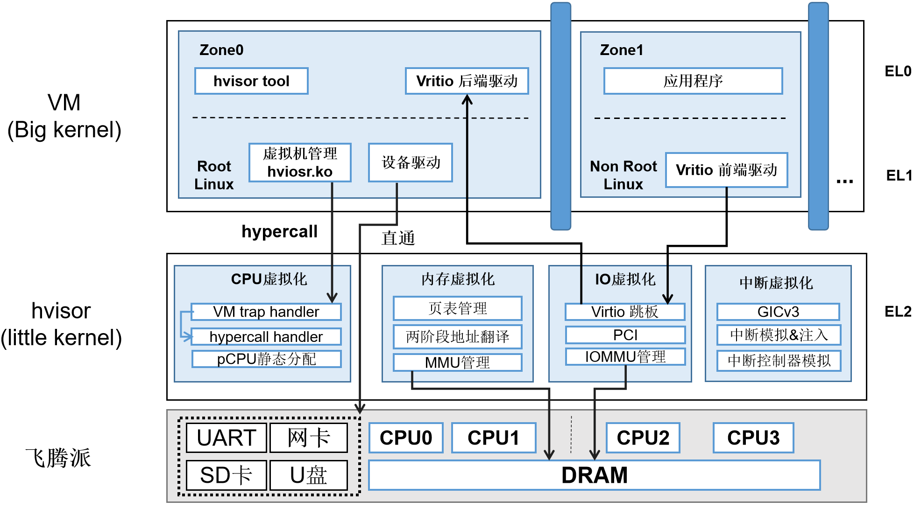
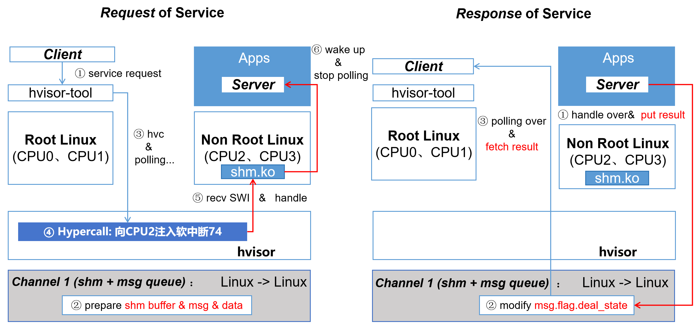
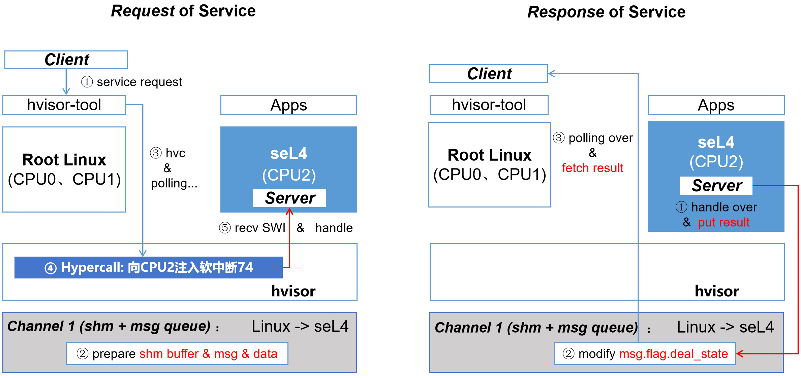
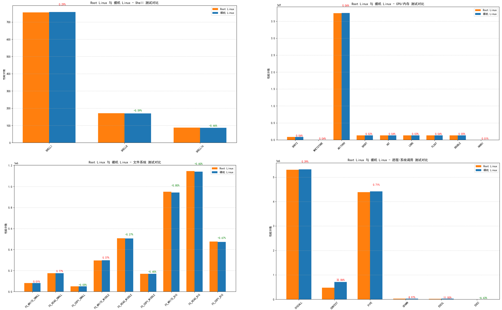
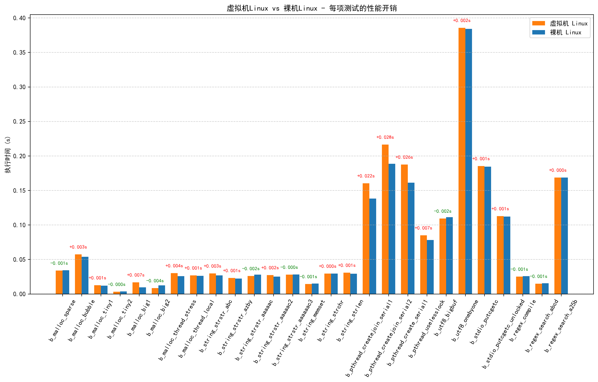
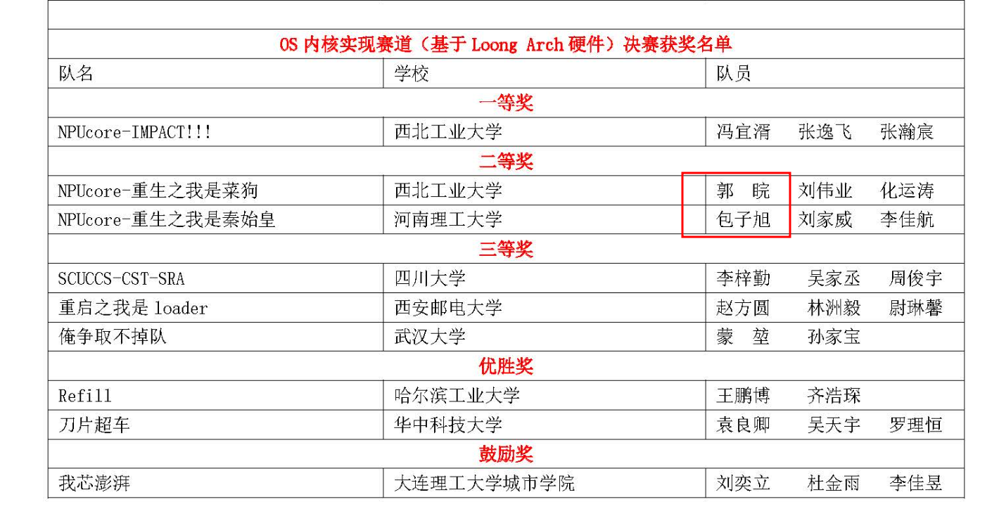
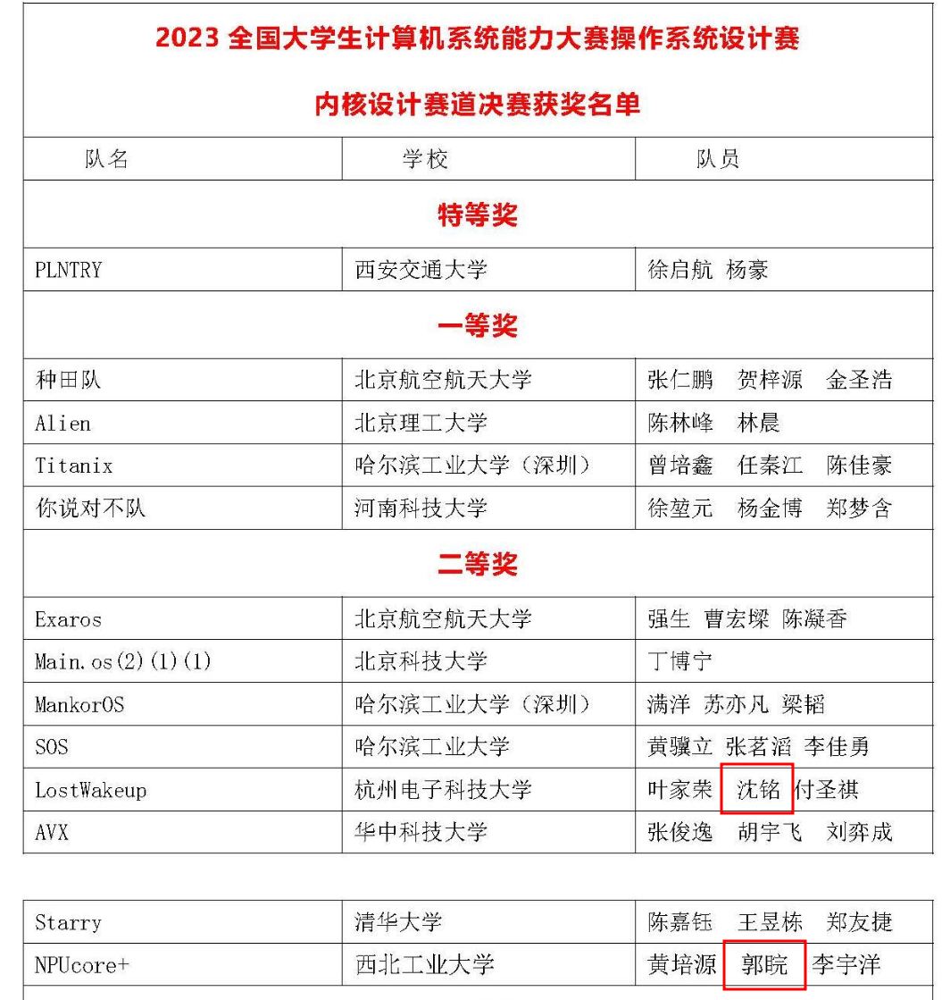
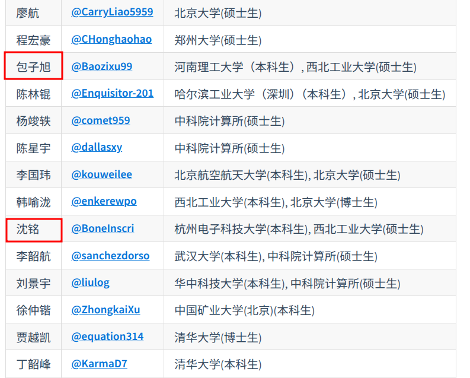

# Proj410——基于飞腾平台的Type-1型Hypervisor移植优化

- 队名：GPNPU
- 队员：包子旭、沈铭、郭睆（均曾获内核赛二等奖）
- 指导老师：张羽教授
- 学校：西北工业大学

## 从内核赛到功能赛的追梦之旅

带着本科期间未竟的内核开发理想，我们以研究生身份重返赛场。项目历时**75**天（2025.6.4-8.17），其间我们完成了大量的开发与验证工作，我们累计修改代码修改量**超过6600行**，涉及**hvisor、hvisor-tool、sel4test三个仓库**，commit提交次数**60余次**，超过**1000次**SD卡插拔与测试。

本项目不仅**完成了赛题要求的全部必选内容**——将Type-1 Hypervisor（hvisor）成功适配并稳定运行于飞腾多个平台，还在此基础上**额外实现了多项内容**：
1. **高效跨虚拟机通信机制 —— HyperAMP**
   - 基于**共享内存**与**核间中断 (IPI)** 构建统一通信通道
   - 支持**Root Linux ↔ Non-Root Linux**的双向安全通信。
2. **seL4 微内核飞腾平台支持**
   - 串口驱动实现
   - 中断控制器适配
   - 内核线性映射区物理内存管理
3. **Linux ↔ seL4 异构虚拟化通信验证**
   - seL4 成功运行在hvisor的 **Non-Root VM**
   - 实现 **Linux ↔ seL4** 的跨虚拟机安全通信，验证了HyperAMP在**异构虚拟机环境**下的稳定性与可扩展性

## 项目概述

随着信创产业的不断推进，国产处理器平台对虚拟化技术提出了更高的性能、安全性和自主可控性要求。在教育、国防、工业控制等关键领域，**轻量级、高隔离度、可裁剪的虚拟化解决方案**正逐步成为主流选择。

本项目依托飞腾公司推出的国产开源教育平台 —— **飞腾派开发板**，围绕其对 **ARMv8-A 架构**的良好支持，展开对虚拟化系统的适配与验证。我们选用由 **矽望社区（Syswonder）主导开发的开源项目 [hvisor](https://github.com/syswonder/hvisor)** 作为核心虚拟化内核。**hvisor 是用 Rust 实现的 Type-1 Hypervisor**，采用**分离内核（Separation Kernel）架构**，注重虚拟机之间的资源隔离，已在多个国产平台上展现出良好的可移植性与运行性能。

在本项目中，我们基于 **hvisor 的 dev 分支**，以 `2025年5月5日` 合并的 [`#149 pull request`](https://github.com/syswonder/hvisor/pull/149)（rk3588_dev 分支）为**开发基线**，完成了对飞腾派、翰博薇E2000Q教育开发板平台的移植与功能验证。目前，系统已成功在飞腾派、翰博薇E2000Q教育开发板上启动多个虚拟机（VM），并完成了包括 **GICv3 中断控制、共享内存通信机制、Virtio 系列虚拟设备（如 console、block、net）** 在内的核心功能验证，为后续在国产平台构建可信虚拟化基础奠定了基础。我们还完成了**seL4 微内核向飞腾派平台的移植**，并将**seL4作为 Guest OS** 运行于 hvisor 的 Non-Root 虚拟机中。此外，我们还**基于共享内存和核间中断设计了虚拟机间通信机制HyperAMP**。 能够实现Root Linux 与 Non-Root Linux 间，以及 Root Linux 与 Non-Root seL4 间的安全、可控、高效的跨虚拟机通信。该机制在架构设计上通过统一的共享内存通道与事件通知机制（由 hvisor 驱动核间中断实现）完成跨虚拟机数据与控制信号传递，由 hvisor 提供集中式访问控制策略，以防止越权访问与非法通信；在性能优化方面，采用高效的共享内存管理策略以减少数据复制与传输开销，从而显著降低延迟与性能损耗；在协议设计上，针对控制信息传递与大规模数据传输等不同需求，集成轻量级消息摘要与IPI通知机制，实现低延迟的消息交换与高吞吐的数据传输。同时，该框架具备良好的可扩展性，可在异构虚拟机环境（宏内核Linux、微内核seL4）中灵活部署，并能适配未来新服务的集成需求，为系统功能扩展提供坚实基础。

## 涉及的其他仓库

本项目在实现飞腾平台虚拟化支持及跨虚拟机通信机制的过程中，依赖并基于多个相关开源仓库进行开发与适配，主要包括：
* **[hvisor-tool](https://github.com/Baozixu99/hvisor-tool)**
  团队基于`Pull Request #36 (revert-35-revert-34-main) `版本hvisor-tool仓库进行功能拓展，主要聚焦于虚拟机间通信机制的支持与优化。本仓库包含附属于hvisor的命令行工具及内核模块，命令行工具中还包含了Virtio守护进程，用于提供Virtio设备。我们增加了虚拟机间共享内存分配、事件通知机制以及虚拟机间通信协议的实现，是虚拟机间通信机制HyperAMP开发的主要仓库。

* **[seL4test](https://github.com/Baozixu99/sel4test)**
  团队基于开源的 seL4 微内核代码仓库，完成了对飞腾派平台的移植和驱动适配工作，确保了 seL4 能够作为 Non-Root 虚拟机稳定运行。该仓库还包含官方的测试用例以及我们实现的虚拟机间通信机制，支持异构虚拟机环境下的跨虚拟机通信验证。


## 📚 项目文档导航

本项目的相关手册位于 `docs` 目录下，以下是一些重要的文档：

#### 🔧 如何运行该项目？

> 想要快速启动并运行本项目？请参考以下文档：

-  [快速运行手册](./docs/快速运行手册.md)
  提供了简洁明了的环境搭建、依赖安装及运行流程，适合初次使用或快速部署。

------

#### 🛠 遇到的问题及解决方法

> 在开发过程中我们遇到了一些技术难点和调试问题，所有相关的调试日志与解决方案均记录在此：

- [hvisor 适配飞腾平台Debug日志与问题汇总](./docs/Debug日志与问题汇总.md)
  按时间顺序记录了hvisor在飞腾派与翰博薇E2000Q教育开发板适配过程中产生的调试日志、问题定位思路及问题解决过程，便于后续复盘与故障追踪。
- [HyperAMP开发过程遇到的问题](./docs/HyperAMP开发过程遇到的问题与解决方案.md)
  详述在HyperAMP跨虚拟机通信机制设计与实现过程中遇到的技术挑战，包括共享内存管理、事件通知优化及协议适配等，并附带对应的代码与解决方案。
- [seL4适配飞腾平台技术文档](./docs/seL4适配飞腾派技术文档.md)
  记录了seL4微内核移植到飞腾派及其在hvisor Non-Root 虚拟机中遇到的问题及解决方法。

#### 📄 决赛完整开发文档
> 如果你需要了解整个比赛期间的开发思路与实现细节，请参考：
- [决赛设计文档](./docs/决赛设计文档.pdf)
  涵盖项目背景、整体架构设计及功能实现细节，重点介绍决赛阶段的功能扩展、优化提升和关键技术突破，适合深入了解完整的项目内容。
------

#### 🎥 其他资源（持续更新）

> 以下为辅助理解项目内容的额外资源：

- **演示视频1——hvisor完成赛题要求的所有功能演示**：百度网盘链接: https://pan.baidu.com/s/1_1W7Ip2kRFOxlhY51sruAQ?pwd=6mnq 提取码: 6mnq
- **演示视频2——hvsior半实物仿真应用验证**：百度网盘链接: https://pan.baidu.com/s/1aEHYBctuHOwGJVC3rlHKMA?pwd=xphj 提取码: xphj
- **项目PPT**：网盘链接: https://pan.baidu.com/s/1znSUTrtiFW81QjFqRPBV8A?pwd=q9ur 提取码: q9ur


## 总体架构图

本项目基于 syswonder 社区的 `hvisor` 实现了飞腾派平台的 Type-1 Hypervisor 适配方案。下图展示了该方案的整体架构。`hvisor` 直接运行在飞腾派开发板上，该平台具备 4 核 ARMv8 架构 CPU、2GB 内存以及串口、网卡、SD 卡和 USB 设备等多种外设资源。作为一个用 Rust 编写的轻量级、高效型 Hypervisor，`hvisor` 在架构中被称为 *Little Kernel*，其核心职责是接管底层硬件资源，并为上层虚拟机提供完整的虚拟化支持，包括 **CPU 虚拟化、内存虚拟化、I/O 虚拟化和中断虚拟化**。在 `hvisor` 提供的虚拟化环境中，可运行多个虚拟机，架构中称为 *Big Kernel*。其中，`zone0` 是 Root 虚拟机，具备对所有虚拟机的管理权限，并通过 Hypercall 接口与 `hvisor` 交互，实现虚拟机的创建、销毁、资源控制等功能。

从特权级视角来看，`hvisor` 运行于最高特权级 **EL2**，Guest OS（如non-root Linux）运行在 **EL1**，应用程序运行在 **EL0**。各虚拟化模块设计如下：

- **CPU 虚拟化**：为每个虚拟机提供独立的 CPU 上下文，并注册 trap handler，用于处理来自 Guest 的陷入。采用静态分配的方式划分物理 CPU 资源；
- **内存虚拟化**：利用 ARMv8 硬件支持的两阶段地址转换机制，实现不同虚拟机之间的内存隔离；
- **I/O 虚拟化**：基于 virtio 跳板机制实现，non-root 虚拟机中的 virtio 前端驱动与 `zone0` 用户态中的 virtio 后端服务通过 `hvisor` 进行通信；同时支持 IOMMU 管理和 PCI 设备模拟；
- **中断虚拟化**：基于 GICv3 架构实现虚拟中断控制器的建模，并支持中断的模拟、注入与转发。

此外，运行在 `zone0` 中的 Root Linux 拥有所有外设的直通访问权限，并通过内核模块配合 `hvisor-tool` 工具，使用 `ioctl` 系统调用与 `hvisor` 通信，实现虚拟机的启动、关闭和资源管理等功能。运行在管理内核Root Linux用户态的应用程序需向Non Root的Linux/seL4发出服务请求时，将通过hvisor-tool创建一个Client，这个Client将完成从Root Linux到Non Root Linux的服务通信的Channel、基于共享内存的缓冲区和消息队列的初始化。然后在Root Linux和Non Root Linux/seL4中提前设置好的一块共享内存中的数据缓冲区中申请一块内存区域，将完成此服务所需的输入数据放入缓冲区中，并从消息队列的空闲队列中申请一个msg，将请求的安全服务id、对应数据在缓冲区中的偏移offset和长度length放入msg中，然后在用户态EL0/EL1特权级下，通过hypercall陷入位于EL2特权级下的hvisor。hvisor将处理这个hypercall，然后将中断转发并注入到Non Root Linux/seL4中，Non Root Linux/seL4收到中断后，将从共享内存中的消息队列msg queue中取出一个msg，解析msg中的service_id，以及位于缓冲区中的数据，然后批量完成服务。完成服务后，Non Root Linux/seL4将修改msg的deal_state字段，并修改msg queue的working_mark字段，告知Root Linux可以进行下一次批次的服务请求。

## 代码目录结构：

```text
platform
├── aarch64
│   ├── imx8mp
│   ├── qemu-gicv2
│   ├── qemu-gicv3
│   ├── rk3568
│   ├── e2000q                ← 本项目新增平台适配目录
│   ├── phytium-pi            ← 本项目新增平台适配目录
│   │   ├── board.rs          ← Zone0（root linux）配置逻辑
│   │   ├── cargo
│   │   │   ├── config.template.toml
│   │   │   └── features      ← 编译特性配置
│   │   ├── configs
│   │   │   ├── zone1-linux.json		← zone1 虚拟机配置文件
│   │   │   └── zone1-linux-virtio.json ← zone1 virtio配置文件
│   │   ├── image
│   │   │   └── dts
│   │   │       ├── Makefile	← 设备树编译脚本
│   │   │       ├── linux1.dts	← zone0(root linux)设备树
│   │   │       ├── linux2.dts	← 精简后的zone1(non root linux)设备树
│   │   │       └── phytium-pi-board-v2.dts  ← 厂商原始设备树
│   │   ├── linker.ld         ← 镜像链接脚本（指定加载地址）
│   │   └── platform.mk       ← 平台编译规则（与 linker.ld 同步）
│   └── zcu102
├── loongarch64
│   ├── ls3a5000
│   └── ls3a6000
├── riscv64
│   ├── qemu-aia
│   └── qemu-plic
└── x86_64
    └── qemu
```

## 🚀 开发计划

###  1.初赛阶段

|  时间节点   |                           开发内容                           |
| :---------:   | :----------------------------------------------------------: |
| **5月25日** | 解读赛题要求，完成报名流程，明确项目目标，制定初步开发计划并分配任务。 |
| **5月30日** |   收到飞腾派开发板，阅读硬件手册，配置交叉编译与调试环境。   |
| **6月2日**  | 在 hvisor 中添加对 **Phytium-Pi** 平台的支持，完成代码与硬件配置解耦；在 `platform/` 目录下分类存放架构与开发板相关配置。 |
| **6月4日**  | 根据飞腾派内存布局规划加载地址，完成 hvisor、Root Linux、Non-root Linux 镜像加载地址划分；实现对 **PL011 UART** 的驱动适配，支持串口通信。 |
| **6月6日**  | 完成 hvisor 核心功能启动，具备 Zone 创建与管理能力。 |
| **6月15日** | 成功创建并启动 **Root Linux（Zone0）**，实现 console 显示与基本 shell 操作。 |
| **6月22日** | 成功创建并启动 **Non-root Linux（Zone1）**，验证中断注入与 Virtio 设备初始化路径。 |
| **6月27日** | 支持**Non-root Linux（Zone1）**使用Virtio Block、Virtio  Console、Virtio Net |

### 2.决赛阶段

#### 2.1 适配飞腾 E2000Q 或者D2000 开发板

|      时间节点       |                           开发内容                           |
| :-----------------: | :----------------------------------------------------------: |
|     **7月8日**      |           完成hvisor对翰博薇E2000Q教育开发板的适配           |
|     **7月15日**     |            hvisor增加对共享内存通信和软中断的支持            |
|     **7月24日**     | hvisor-tool（hvisor命令行工具）增加添加内核模块以及完成共享内存的测试，non root linux能读取到root linux写入共享内存中的数据 |
|     **8月1日**      |  完成基于共享内存和核间中断的虚拟机间通信机制的设计HyperAMP  |
|     **8月6日**      |                    将sel4移植到飞腾派平台                    |
|     **8月10日**     | seL4作为 Guest OS 行于 hvisor 的 Non-Root 虚拟机中，并能通过HyperAMP读取到root linux写入共享内存中的数据 |
| **8月11日-8月17日** |                      进行性能测试和优化                      |

#### 2.2 实现虚拟机间通信框架
- 通过核间中断（IPI）和共享内存机制实现跨虚拟机通信，借鉴现有OpenatAMP核间通信框架的思想进行扩展和优化。
**Root Linux与Non Root Linux之间的通信过程：**



**Root Linux与seL4之间的通信过程：**




#### 2.3运行 Benchmark 并进行性能分析与优化

#### 计划测试集：
benchmark有Unixbench、libc-bench。
**Unixbench的测试结果：**



**libc-bench的测试结果：**



#### 2.4 进行GPU虚拟化技术的探索

当前主流的GPU虚拟化技术分为三类：直通独占、直通共享和API转发，各有其适用场景和优缺点。
- 直通独占（Pass-through Exclusive）将物理GPU完全分配给单个虚拟机，性能损失最小（通常低于3%），适合对图形性能要求极高的场景，如自动驾驶系统的实时渲染。但这种方案无法实现资源共享，在多个虚拟机需要图形加速时如同时运行仪表盘和娱乐系统，需要配置多个GPU，增加硬件成本。
- 直通共享（Pass-through Shared）通过硬件虚拟化支持（如NVIDIA的vGPU、ARM的Mali GPU分域）将单个GPU划分为多个虚拟实例。这种方案实现了真正的资源共享，每个虚拟机获得独立的虚拟GPU（vGPU），具有自己的显存分区和调度配额。现代GPU如Mali-G78AE支持多达8个硬件分域，隔离性能损失控制在10%以内。
- API转发方案最具灵活性，其核心思想是将图形API调用（如OpenGL、Vulkan）从客户端虚拟机转发到拥有物理GPU的主机虚拟机执行。前端虚拟机中的应用程序通过Mesa 3D图形库将OpenGL命令转换为TGSI中间表示，virtio-gpu驱动再将其封装为virtio协议命令。后端通过vhost-user-gpu模块接收命令，转换为本地API调用并由物理GPU执行。

## 🔬 团队基础

参加本次比赛并非一时兴起，而是从本科到研究生的持续积累的自然结果，

是无数个实验室的深夜和内核代码汪洋中的挣扎，最终汇聚成的突破契机…
___
（1）扎实的比赛经验与成果

全体成员本科阶段曾参加 全国大学生系统能力大赛——操作系统内核赛道，并均获 全国二等奖，在操作系统内核的设计与实现方面具备丰富的实战经验，对于LoongArch指令集和系统软件内核设计具有十分深刻的理解。
https://www.sohu.com/a/814157345_121118940

2024全国大学生计算机系统能力大赛操作系统设计赛内核赛道获得全国二等奖：

2023全国大学生计算机系统能力大赛操作系统设计赛内核赛道获得全国二等奖：

（2）活跃的开源社区贡献者
包子旭和沈铭是开源社区syswonder中hvisor项目的贡献者：
- 包子旭：负责hvisor的Aarch64架构的开发与维护
- 沈铭：负责hvisor的LoongArch64 架构的开发与维护

https://www.syswonder.org/#/projects


## 🏆 比赛收获
想要完成本项目绝非易事，即使通关过NJU的PA，写过模拟器和调试器，参加过操作系统内核赛，编码和调试依然是困难重重。当系统的模块增多，代码量从原先的几千行，到上万行，复杂性大大增加是必然性的。具有正确的调试方法和利用合适的工具，能巧妙的发现和解决许多看似很复杂的问题。
当Linux成为程序调试的负载时，系统的复杂性将大大提升，采用diff-test的思想能解决绝大部分问题！想要让虚拟化的功能正确，需要保证虚拟机的运行行为和裸机运行的行为一致，这形成了一个天然的diff！
让代码编写、测试和运行滚动起来，不要将时间浪费在重复的机器劳动上，通过自动化脚本工具加速开发流程！
没有源码，那就hack。在系统软件程序员面前，只要敢想，就总会有办法，从入门到hacker！
只要程序有输出，那么根据输出反向定位对应的源码，然后读懂它，总能有些思路！快速定位代码，在源代码的大海中能快速找到想要读的那一行是系统软件开发的必备能力。
善于使用AI大模型，过分依赖AI不可取，但完全不使用AI也是万万不行，AI不仅可以辅助读懂代码，还能减少许多重复的机械的劳动，极大的提高代码的开发效率。
当程序卡住时，停下来，仔细想想，CPU就是一个无情执行指令的机器，现在整个系统卡在了哪里？大概执行到哪个地方时是否是某个寄存器不正确？是否是某个指令或者内存区域的数据不正确？是否可以进行diff-test？
本项目模块众多，软件运行的层次深，对系统编程的要求极大，即使面对这样复杂的棘手的项目，经历过规范和系统的训练也能十分从容面对。编码、测试的方法正确，恰当使用工具，能极大简化复杂的系统软件开发！
不要频繁构建镜像并上板运行和测试，因为即使有自动化构建的工具，构建一次镜像，并在开发板上运行的时间成本是很大的。利用防御性编程的思想，多写assert和关键的log输出能让一次运行获取到系统运行的状态更多，减少调试成本。
## 📬 联系方式
如有任何问题，欢迎提交 Issue。

## 🙌 致谢
## 致谢

本项目的完成离不开多方支持与帮助，在此对所有给予指导、支持与帮助的个人与组织表示真诚感谢：

- 感谢 **syswonder 社区**（特别是陈康老师、曹东刚老师）在技术指导与资料支持上的帮助，使我们在 hvisor 的移植过程中少走了许多弯路。同时感谢 hvisor AArch64 分支 maintainer 李国玮在架构细节上给予的耐心解答与技术建议。
- 感谢我们的指导老师 **张羽教授** 对项目方向的把控、资源协调与决赛准备中的指导。
- 感谢飞腾（Phytium）平台的硬件支持与文档，使得我们得以在国产处理器平台上完成完整的移植与验证工作。
- 感谢队员 **包子旭、沈铭、郭睆** 的通力协作与不懈努力，正是大家在项目移植实现、通信框架开发、系统调试以及文档整理等方面的分工协作与紧密配合，才使得项目在短时间内取得了较为完整的成果。